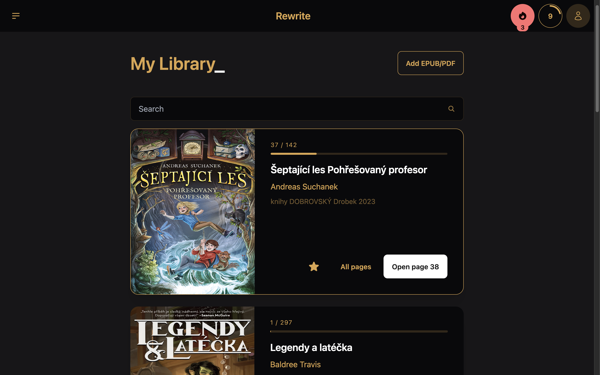
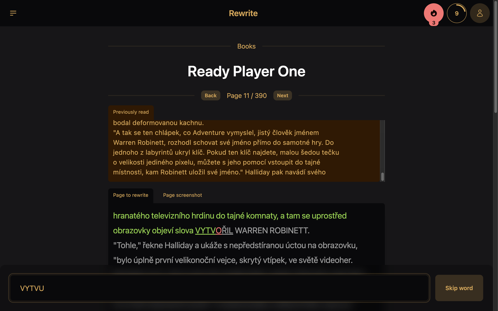
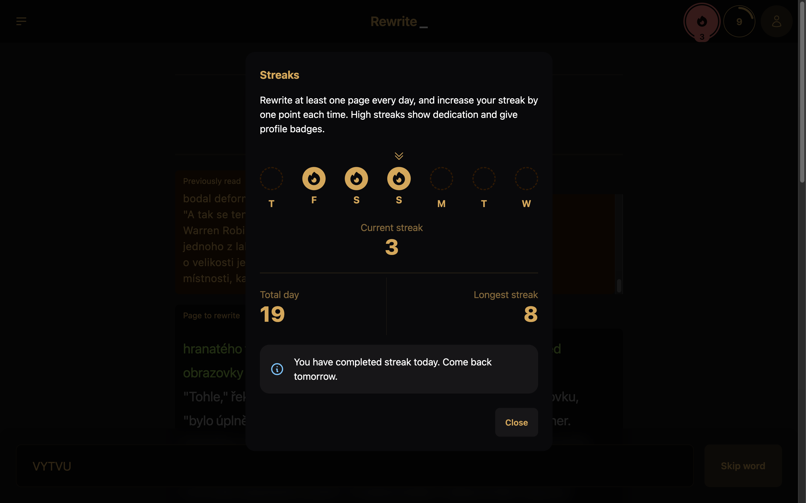
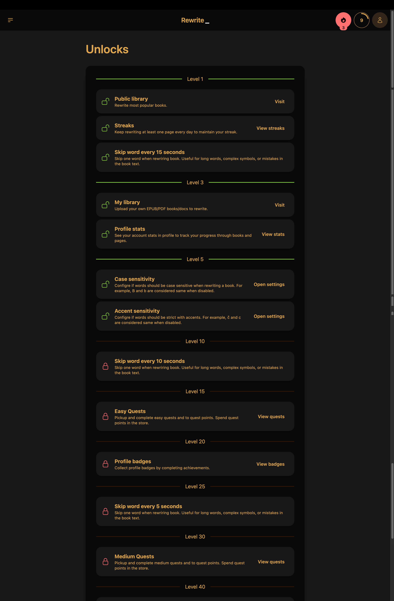

# 💻 Rewrite\_

Practice typing skills and speed by rewriting books as you read them. Use your own books for learning or entertainment.

- ✅ Custom .EPUB and PDF files
- ✅ Public library
- ✅ Leveling system with unlocks
- ✅ Streaks
- ✅ Configurable difficulty
- ✅ Stats and Achievements
- ⏳ Quests and reward shop
- ⏳ 0 Trust server validation
- ⏳ Public and friends leaderboards
- ⏳ Community events and goals









## 🎓 How to use

All you do is upload a book (or pick one from the public library) and rewrite it, letter by letter. Your goal is to finish the page, finish entire book, or even entire library.

**Main use-cases:**

1. Learning method

Rewriting school materials could help keep focus and ensure 100% correctness when writing Can help in med schools, law schools.. Anything with professional vocabulary.

2. Writing practice

When learning a new language, writing is one of the skills. Rewriting helps to build habit for specific words, and learning to write them correctly. To this day I struggle with words like through, thought...

3. Simply a game

There are a lot of gamification features like quests, achievements, levels... Lovers of RPG can get intrigued, do some micro-learning while entertaining themselves

# 🗒️ Project-specific TODOs

TODO: New payment model (pay per page)
TODO: Pagination on pages of book
TODO: Safer way to give back taken tokens if something fails. And only process if enough tokens after initial convert to PNGs
TODO: Ability to delete book
TODO: Screenshot always on
TODO: Show current user details somewhere
TODO: Buttons to go back always to go to public lib
TODO: More public books
TODO: Update SEO stuff
TODO: Community goals
TODO: Friend leaderboards

```markdown
Shop:
Restore highest streak (15 coins)
Double XP for 1 hour (5 coins)
10x Auto-mistake-skip (3 coins)
```

# 🤖 Auto-generated docs

Everything you need to build a Svelte project, powered by [`create-svelte`](https://github.com/sveltejs/kit/tree/main/packages/create-svelte).

## Creating a project

If you're seeing this, you've probably already done this step. Congrats!

```bash
# create a new project in the current directory
npm create svelte@latest

# create a new project in my-app
npm create svelte@latest my-app
```

## Developing

Once you've created a project and installed dependencies with `npm install` (or `pnpm install` or `yarn`), start a development server:

```bash
npm run dev

# or start the server and open the app in a new browser tab
npm run dev -- --open
```

## Building

To create a production version of your app:

```bash
npm run build
```

You can preview the production build with `npm run preview`.

> To deploy your app, you may need to install an [adapter](https://kit.svelte.dev/docs/adapters) for your target environment.
